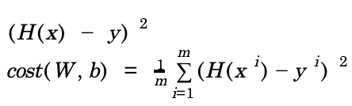
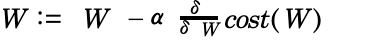
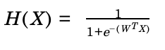
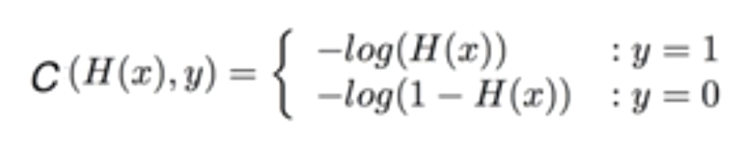
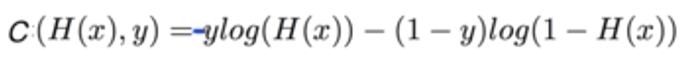
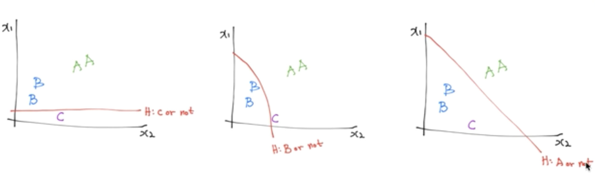
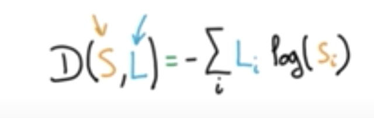
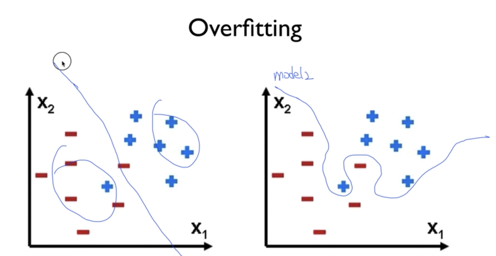
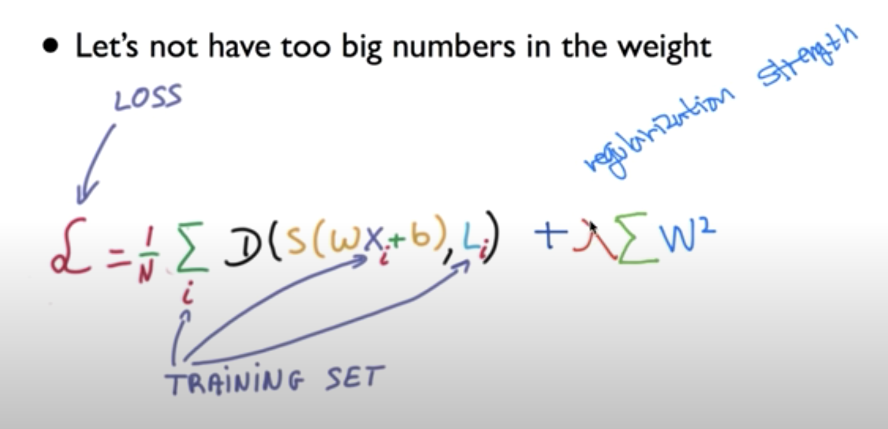
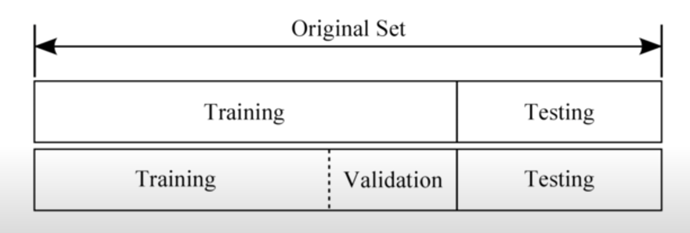

# deep-learning-zero-to-all-study

## Lec 1
1. supervised learning이란?
- training set(정해져있는 또는 labeled 된 데이터)을 갖고 학습하는 것
2. unsupervised learning이란?
- data(unlabeled data)를 보고 스스로 학습하는 것
3. training data set이란?
- 모델을 학습하기 위한 dataset?
4. supervised learning types 3가지?
- regression, binary classification, multi-label classification
5. data flow graph-node
- mathematical operation
6. data flow graph-edge
- multi-dimensional data array(tensor)
7. rank, shape, type
- rank: array의 차원
- shape: element에 몇개가 들어있는지
- type: data type

## Lec 2
1. Linear Regression이란? 
- linea한 model이 우리가 가진 데이터와 맞을 것이다 라는 가설을 세우고 분석하는 것 
- H(x) = Wx + b
2. Linear Regression의 목표
- 가장 작은 값을 갖는 cost(W,b)를 구하는 것
3. cost/lost function이란
- 가설과 실제 data의 거리 계산 
- 
  - 여기서 m은 데이터의 갯수

## Lec 3
1. gradient descent algorithm이란?
- 경사를 따라 내려가는 알고리즘
2. gradient descent algorithm의 동작 원리
- initial guesses에서 parameter(W,B)를 조금씩 바꿔서 local minimum을 찾는 것
3. 사용되는 공식
- 
  - 여기서 α는 learning rate 
4. cost function을 설계할 때 주의할점 
- cost function의 모양이 convex function이 되는지 확인필요

## Lec 4
1. wx1*wx2*wx3*...*wxn를 matrix로 표현?
2. WX vs XW
- Matrix에서는 XW로 표현
3. [N,1]의 표현
- [None, 1]
4. Queue_runner란?
- 큰 파일을 나누어 queue에 적재하여 numpy 또는 다른 자료구조의 max값을 넘지 않게 해주는듯

## Lec 5
1. Logistic Classification의 가설 함수 (softmax regression)
- 
- sigmoid(logistic)
2. 사용 이유
- Hypothesis의 값을 0과 1사이의 값으로 유지시키기 위해 
- binary classification을 위함

## Lec 5-2
1. 기존 cost function을 사용할 시 문제점
- local minimum이 생겨서 시작 위치에 따라 결과값이 다르게 도출됨
2. cost function을 변환하여 문제해결
- 
- 

## Lec 6
1. Multinomial classification의 경우
- A or not, B or not, C or not으로 분류 할 수 있다.
- 
2. one-hot encoding이란?
- 가장 큰 확률의 값을 1로하고 나머지를 0으로 하는 것
3. cross-entropy cost function
- 
4. cross-entropy vs. logistic regression
- 

## Lec 7
1. learning rate overshooting
- learning rate의 값이 너무 커서 결과값이 수렴하지 않고 튀는 것
ex) 결과값이 nan
2. small learning rate
- learning rate의 값이 너무 작아서 결과값을 수렴하는데 너무 오랜시간이 걸리는 것
- local minimum에 갖힐 수 있음
3. data preprocessing이란
- data값의 차이가 클 경우, normalization을 통해 차이를 줄일 필요가 있음. (데이터 전처리)
- standardization
- MinMaxScaler()
4. Overfitting이란?
- 모델이 너무 잘 맞아서 문제가 생기는 것
- 
- 해결방법
  - training data가 많거나
  - feature의 갯수를 줄이는 것
  - Regularization
5. Regularization이란
- Let’s not have too big numbers in the weight
- 

## Lec 7-2
1. Training set vs. Test set vs. Validation set
- 기존의 갖고 있는 데이터 셋을 7:3으로 나누어 model을 training set으로 모델을 훈련시키고, 나머지 test set으로 검증한다. validation set은 learning rate를 tuning 하는데 사용한다.
- Training set: 연습문제
- Validation set: 실전 모의고사
- Test set: 실제 시험
- 
2. online learning이란?
- 큰 데이터를 나눠서 학습시키는 것. 추가되는 데이터 또한 기존 모델에 학습된다.
3. epoch
-  전체 데이터셋을 한번 train한 것
4. batch size
- epoch을 일정사이즈로 자른 것
- 한번에 몇개씩 학습시킬것인가

## Lec 8
[
  [
    [ 
      [1,2,3,4],[5,6,7,8],[9,10,11,12] 
    ], 
      [1,2,3,4],[5,6,7,8],[9,10,11,12] 
  ]
]
Rank 는 [[[[ <-의 개수
Shape은 안에서부터 element 개수
- [1,2,3,4]
Axis,의 수는 rank의 개수와 같음
- 밖에서부터 0, 안쪽으로 n (안쪽 -1도 가능)
- 축을 기준으로 연산할 때 사용됨
연산에서는 matmul을 해야됨
- matrix1*matrix2는 결과가 다르게 나옴
Broadcasting에 주의해야함
- matrix가 맞지 않더라도 맞춰서 연산해주는 것

## Lec 9
1. Back propagation이란?
- 예측값과 출력값을 비교하여 오류(cost)를 갖고 뒤에서 앞으로 미분값과 어떤 것을 수정해야할지 계산하는 것
2. bias의 크기는?
- weight의 두번째 값과 같게 설정한다.

## Lec 10
1. NN은 deep하게 할 경우 sigmod의 문제점은?
- 최종값에서 앞으로 갈수록 Y의 sigmoid 값이 0~1사이 값으로 나타나 NN의 앞단에서 경사도가 사라지는 vanish gradient문제가 발생
2. sigmoid vs ReLU
- NN에서는 ReLU를 사용하자
3. RBM이란
- Restricted Boatman Machine
  - weight을 통한 input X의 값과 결과값 Y를 통한 X의 값이 같게 weight의 값을 조정 하는 것
4. Xavier initialization이란?
- weight의 값을 노드의 인풋 갯수와 아웃풋 갯수의 값의 랜덤 값으로 정하고 인풋 값의 제곱으로 나누는 것
5. He initilization이란?
- weight의 값을 노드의 인풋 갯수와 아웃풋 갯수의 값의 랜덤 값으로 정하고 인풋 값의 절반의 제곱으로 나누는 것
6. drop out이란?
- 학습에서 랜덤하게 몇개의 뉴론을 줄이는 것
- overfitting을 방지하기 위함
- 주의) 학습할 때는 dropout하지만, 실제 train할 때는 모두 참여해야한다.
7. Ensemble이란?
- 똑같은 형태의 deep learning을 여러개 만들고 결과를 combine해서 확인하는 것
  - 예) 같은 분야의 전문가를 모아서 평가하는 것

## Lec 11
1. CNN- convolutional neural network
- 주어진 image의 전체를 보는 것이 아닌 일부분을 보는 것
  - 여기서 일부분은 filter
  - 
2. stride란
- filter를 몇칸씩 움직이는지 정하는 단위
3. CNN 결과의 output 크기 공식
- (N-F)/stride + 1
  - N은 이미지의 가로세로 크기
  - F는 이미지의 가로세로 크기
4. pad를 사용하는 이유?
- input의 사이즈와 output의 사이즈가 갖게 나오게 하기 위함
- 보통 filter를 통해 convolution을 거치면 이미지의 데이터 손실이 생김. pad를 통해 손실을 없앤다
5. pooling이란
- convolutional layer의 일부를 체취하여(sampling) 새로운 레이어를 만드는 것
6. pooling을 하는 이유?
- feature의 수를 줄이고 overfitting을 방지하기 위함?
